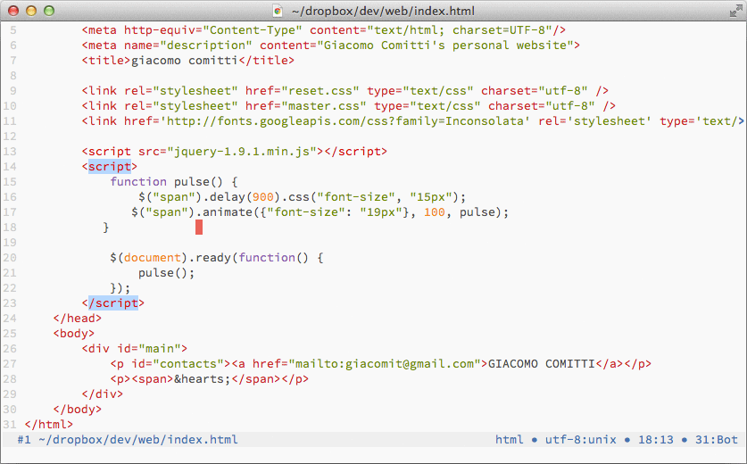
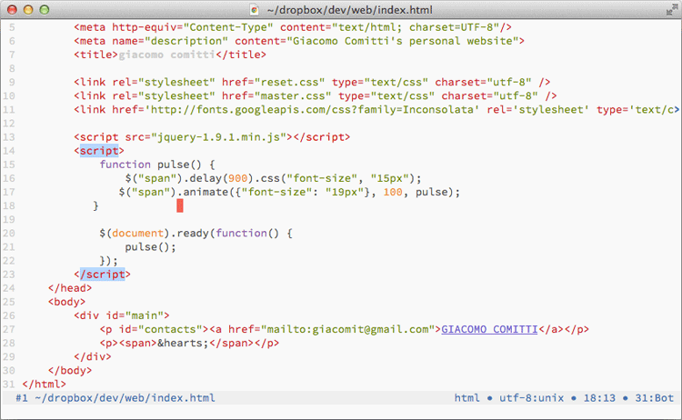
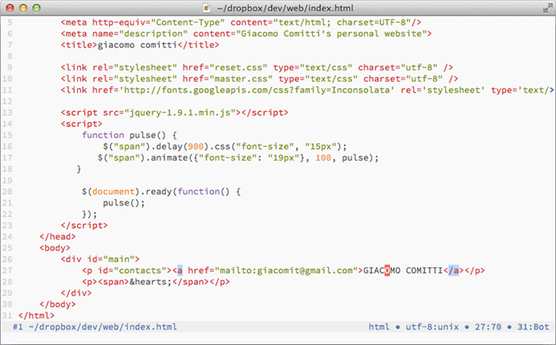

# breeze.vim

**v1.0.1**

###Features
* HTML navigation inspired by vim-easymotion.
* Tag matching.
* Current element highlighting.
* Low level DOM navigation.

### Requirements
* Vim compiled with python 2.6+
* Unix, Mac OS X (untested on Windows)

### Installation
You can either extract the content of the folder into the `$HOME/.vim`
directory or use plugin managers such as Vundle or Pathogen.

### Houston, we have a problem
For any functionality listed below, if it seems that something is not working correctly
(e.g. unresponsive commands), run the `BreezeWhatsWrong` command and you will be shown 
the origin of the problem.

## Tag jumping
   

As you can see this way of navigating the document is heavily inspired by vim-easymotion.
To jump to following tags use the command `BreezeJumpF`. 
Use `BreezeJumpB` to jump to preceding tags.

When you run one of the aforementioned commands, Breeze displays
colored marks on the tags you can jump to and wait for your choice.
Once you have moved to a tag you can easily jump back using the `CTRL+O` 
vim mapping (:help CTRL+O). Note that when you are asked to insert the target
key you can exit the whole process pressing either `<ESC>` or `CTRL+C`.

### Settings

**g:breeze_jump_to_angle_bracket**: set this option to 1 to jump to the
opening angle brackets of the tag you are jumping to. Set this option to 0 to
jump to the first letter of the tag instead.

**NOTE**: when setting the following options you can follow two ways:

  * use a long list of "attribute=color" separated by spaces (as you would
    normally do when defining highlight groups) such as guifg=#424242, ctermfg=242, etc..

  * use the name of a previously defined highlight group. Note, however,
     that this does not work with highlight groups defined in your `.vimrc`.

**g:breeze_shade_color**: this setting defines the color that is used to shade
the background text when you are using the *jumping* functionality.   
*default*: `gui=NONE guifg=#777777 cterm=NONE ctermfg=242`

**g:breeze_shade_color_darkbg**: this setting defines the color that is used to
shade the background text when you are using the *jumping* functionality with
dark backgrounds (&background == dark). 
If the value is an empty string the *g:breeze_shade_color* setting is used for dark backgrounds.  

*default*: ``

**g:breeze_jumpmark_color**: this setting defines the color that is used to
highlight jump marks when you are using the *jumping* functionality.  
*default*: `gui=bold guifg=#ff6155 cterm=bold ctermfg=203`

**g:breeze_jumpmark_color_darkbg**: this setting defines the color that is used
to highlight jump marks when you are using the *jumping* functionality with
dark backgrounds (&background == dark). 
If the value is an empty string the *g:breeze_jumpmark_color* setting is used for dark backgrounds.  

*default*: ``

## Tag matching and current element highlighting
   

By default Breeze highlights the opening and closing tags of the current element.
To turn off this functionality you can set `g:breeze_hl_element` to 0. However,
you always have at your disposal the `BreezeHlElement` command to highlight the current element.
If you prefer highlighting the whole element as a block you can use the `BreezeHlElementBlock` command
(just like the `vat` vim motion. However it seems not working properly with self-closing tags).

Another useful command is `BreezeMatchTag`. If the cursor is on an opening tag,
this command moves the cursor to the corresponding closing tag, and vice-versa.
If the command is called within an element, this command moves the cursor to
its opening tag. Remember that you can easily jump back to previous positions
with `CTRL+O`.

**Limitations:** At the moment current element highlighting is still inefficient for large files
and your movements may become quite slow. So you may be better off disabling the feature for such files
until I'll come up with a fast solution.

### Settings

**g:breeze_highlight_tag**: set this setting to 0 to disable automatic highlighting
of the opening and closing tags of the current element.    
*default*: `1`

**NOTE**: when defining the following settings you have two options:

  * use a long list of "attribute=color" separated by spaces (as you would
    normally do when defining highlight groups) such as guifg=#424242, ctermfg=242, etc..

  * use the name of a previously defined highlight group. Note, however,
     that this does not work with highlight groups defined in your `.vimrc`.

**g:breeze_hl_color**: this setting defines the color that is used to
highlight opening and closing tags.  
*default:* `MatchParen`

**g:breeze_hl_color_darkbg**: this setting defines the color that is used to
highlight opening and closing tags with dark backgrounds (&background == dark).
If the value is an empty string the *g:breeze_hl_color* setting is used for dark backgrounds.  
*default:* ``

## DOM navigation
   

The available commands for DOM navigation cover only low level movements at the
moment but might be useful for exploring dense HTML files.

### Commands

**BreezeNextSibling**   
Moves the cursor to the next sibling node.

**BreezePrevSibling**     
Moves the cursor to the previous sibling node.

**BreezeFirstSibling**     
Moves the cursor to the first sibling node.

**BreezeLastSibling**     
Moves the cursor to the last sibling node.

**BreezeFirstChild**   
Moves the cursor to the first child node.

**BreezeLastChild**   
Moves the cursor to the last child node.

**BreezeParent**     
Moves the cursor to the parent node.
