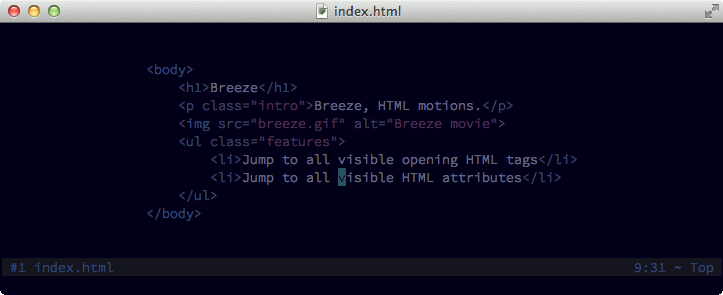

## breeze.vim

Breeze provides a handful of EasyMotion-like HTML motions.



### Installation

Install either with [Vundle](https://github.com/gmarik/vundle), [Pathogen](https://github.com/tpope/vim-pathogen) or [Neobundle](https://github.com/Shougo/neobundle.vim).

### Usage

Breeze does not define any mappings for you, you have to map Breeze motions by yourself. Below an example of how you can set your own mappings:

```vim
" jump to all visible opening tags after the cursor position
nmap <leader>j <Plug>(breeze-jump-tag-forward)
" jump to all visible opening tags before the cursor position
nmap <leader>J <Plug>(breeze-jump-tag-backward)

" jump to all visible HTML attributes after the cursor position
nmap <leader>a <Plug>(breeze-jump-attribute-forward)
" jump to all visible HTML attributes before the cursor position
nmap <leader>A <Plug>(breeze-jump-attribute-backward)
```

After triggering one of the mappings above, Breeze will ask you for where you want to jump to. To abort the whole process press either `<ESC>` or `CTRL+C`.

Breeze allows you to iterate directly over tags or attributes:

```vim
" move to the next tag
nmap <C-N> <Plug>(breeze-next-tag)
" move to the previous tag
nmap <C-B> <Plug>(breeze-prev-tag)

" move to the next attribute
nmap <C-A> <Plug>(breeze-next-attribute)
" move to the previous attribute
nmap <C-S> <Plug>(breeze-prev-attribute)
```

**TIP:** use `<Plug>(breeze-next-tag-hl)`, `<Plug>(breeze-prev-tag-hl)`, `<Plug>(breeze-next-attribute-hl)` and `<Plug>(breeze-prev-attribute-hl)` in order to highlight the line you move to.

This is all you have to know to start jumping around your HTML files. Just remember that once you have jumped somewhere you can easily move back to the previous position with `CTRL+O` (`:h CTRL+O`).

### Settings

**g:breeze\_prompt**

With this option you can set your own custom prompt. You can change its color with the highlight group `BreezePrompt`.

Default: `" Target: "`

**g:breeze\_marks**

With this option you can set the marks used by Breeze to point out all the locations you can jump to. You can change their color with the highlight group `BreezeJumpMark`.

Default: `"abcdefghijklmnopqrstuvwxyzABCDEFGHIJKLMNOPQRSTUVWXYZ"`

### Changing default colors

You can change default colors with the following highlight groups:

- `BreezeJumpMark` this color group is used to highlight all jump marks.
- `BreezeShade` this color group is used to highlight anything but jump marks.
- `BreezePrompt` this color group is used for the prompt look.
- `BreezeHighlightedLine` this color group is used to highlight the current line whenever you move to a tag or attribute.

Below an example of how you can customize default colors:

```vim
" put the following lines in your .vimrc
hi link BreezeShade String
hi BreezePrompt gui=bold
```
